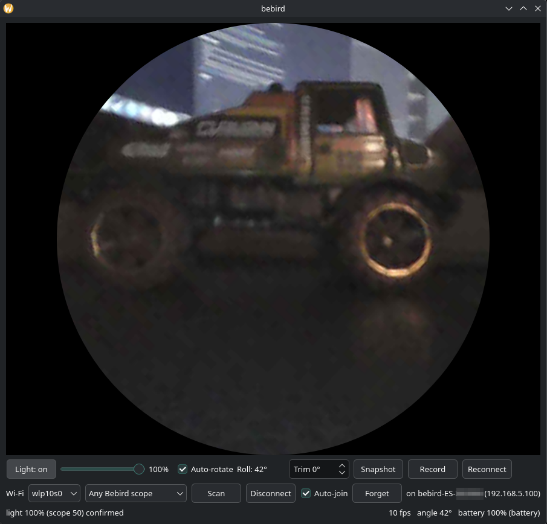

# bebird-viewer

A viewer for **Bebird "ES" Wi-Fi otoscope / ear cameras** that works without the vendor app, an account, or an internet connection. It talks only to the scope, over the scope's own Wi-Fi. There is an Android app and a Linux desktop app.

<p>


</p>

> Not affiliated with or endorsed by Bebird. No vendor code or firmware is included in this repository.

## Android app

Android 10 or later. What you can do:

- **Watch live video**, kept upright by the scope's motion sensor. Pinch to zoom. Set the tip light.
- **Take snapshots and record video.** **Files** opens the folder they're saved in.
- **Annotate** a paused picture with ovals, boxes, arrows, freehand lines and text, in five colours. Marks can be moved or deleted. Save keeps the picture and an annotated copy.
- **Show an approximate mm scale** over the picture: ring, bowtie or bar. It is a best-effort estimate that holds only when the picture is in focus; the scope has no distance sensor.
- **Use more than one scope.** The app remembers each one, with an optional nickname.
- **Disconnect** by holding the button for 2 seconds. **Quit** by holding the power icon (⏻) in the top row for 5 seconds; once video has started, this also switches the scope off.
- **Switch apps briefly.** The connection is kept for a while (1 minute by default) so the video carries on when you come back.

| Ring | Bowtie | Bar |
|---|---|---|
|  |  |  |

### Getting started

1. Turn the scope on.
2. Open the app and tap **Connect**. The first time, allow the permission it asks for (nearby devices, or location on Android 10 to 12).
3. If Android shows a list of networks, pick the scope (`bebird-ES-…`).
4. The picture appears in the circle. Until it does, the circle says what is happening and what to do next.

The app uses the scope's Wi-Fi for itself only, so the rest of your phone's networking is untouched.

### Install

There is no published release yet. APKs will be on [GitHub Releases](https://github.com/aaronsb/bebird-viewer/releases). Until then, [build the APK from source](docs/building.md).

[More about the Android app](docs/android.md)

## Desktop app (Linux)

The desktop app shows the same live video, with light control, auto-rotate, snapshots and recording. It joins the scope's Wi-Fi for you through NetworkManager, without taking over your normal networking.



To run it from source (needs Python 3.10+):

```sh
make run
```

[More about the desktop app](docs/desktop.md): requirements, the standalone binary, controls and command-line tools.

## More

- [Android app](docs/android.md): every control and setting, saved files and their metadata
- [Desktop app](docs/desktop.md): setup, controls, command-line tools
- [Building](docs/building.md): containerized builds and CI
- [Protocol](docs/protocol.md): how the scope talks over Wi-Fi, and the tested device
- [Security notes](docs/security.md)
- [Focus and proximity estimation](docs/focus-detection.md): how the mm scale works and its limits
- [What the official app does on the network](docs/app-analysis.md)

Tested with one scope, the Bebird ES. Other Bebird Wi-Fi models may work; reports are welcome.

## License

Copyright (C) 2026 Aaron Bockelie. Licensed under the [GNU General Public License v3.0 or later](LICENSE) (`GPL-3.0-or-later`). Versions up to and including commit `398f346` were released under the MIT License, and copies obtained under those terms stay MIT.

The Android app's Move icon uses the path of the `open_with` icon, and its Quit icon is the `power_settings_new` icon, both from Google's [Material Design icons](https://github.com/google/material-design-icons), licensed under the [Apache License 2.0](LICENSES/Apache-2.0.txt).
