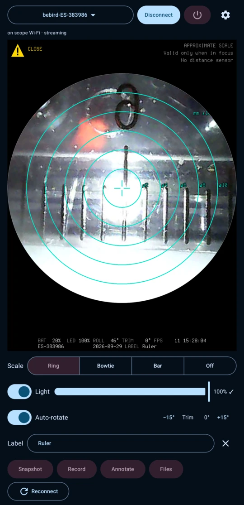
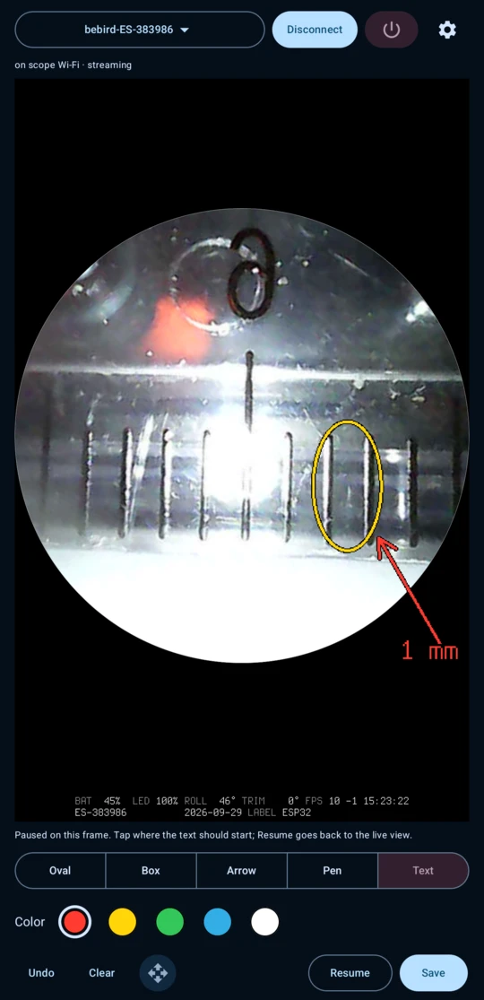
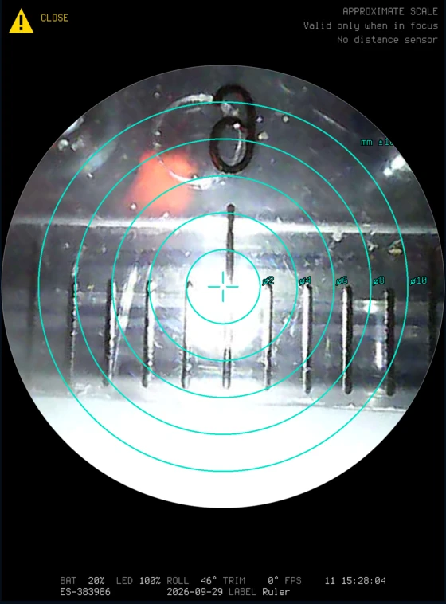
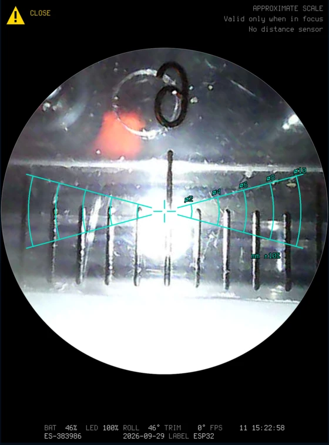
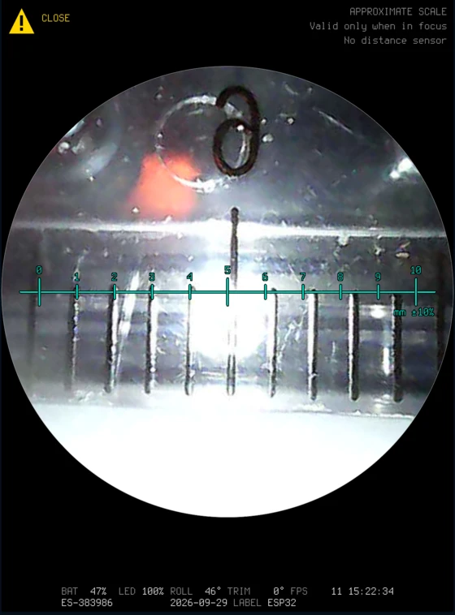

# Android app

A native Android app (Kotlin, Jetpack Compose, Android 10+) in [`android/`](../android/), app ID `com.bockelie.bebird`. It is still in progress; progress is tracked in [#8](https://github.com/aaronsb/bebird-viewer/issues/8). To build it, see [building.md](building.md).

## Screen

From top to bottom:

- **Top row:** the device selector, **Connect** / **Disconnect**, the power button (Quit), and the settings menu (gear).
- **Status line:** the Wi-Fi and stream state.
- **Picture:** the live video in a circle, rotated upright, with pinch-zoom. When there is no picture, the circle says why (for example NOT CONNECTED, CONNECTING…, CONNECTION LOST) and what to do next.
- **Status band** under the picture (when the overlay is on), in a fixed-layout bitmap font: battery, light, roll, trim, fps, time, and the label.
- **Scale:** Ring, Bowtie, Bar or Off (see [Proximity and mm scale](#proximity-and-mm-scale)).
- **Light:** on/off switch and slider. The level is sent once you stop moving the slider, then read back from the scope; ✓ means the scope confirmed it.
- **Auto-rotate** with trim (−15° / +15°).
- **Label:** free text, shown in the band and saved into photos and videos.
- **Snapshot**, **Record**, **Annotate**, **Files**, and **Reconnect**.

## Connecting

The app joins the scope's Wi-Fi as an app-only network, so the phone's normal networking is untouched.

It remembers the scopes you've used, with an optional nickname. Choose, rename or forget them from the device selector. It reconnects to the last one by its exact network name and BSSID. On a Pixel 8 Pro with Android 17, reconnecting this way joined without a dialog right after the first join through the picker. **Pick a different device** shows Android's list of every `bebird*` network.

At launch it connects to the last device on its own, when that device can be joined without Android's picker (**Connect when the app starts**, a setting, on by default). If the scope is off, the app stays idle.

**Reconnect** restarts the video session.

## Disconnect and Quit

Both act only when held; a tap shows a hint.

- **Disconnect:** hold for 2 seconds.
- **Quit** (the power button in the top row): hold for 5 seconds. It finishes any recording, then switches the scope off if video has started (otherwise it disconnects), releases the network, and closes the app.

**Power off scope** in the settings menu (enabled once video has started, after a confirmation) switches the scope off without closing the app. The app sends STOP, then `66 3E`, then lets go of the network. The scope stays off until you press its power button, and stays in the device list.

## Leaving the app

When you leave the app it keeps the connection for a grace period (**Connection…** in the settings menu: immediately, 30 s, or 1, 2, 5 or 10 minutes; 1 minute by default). Video is paused and a notification counts down, offering Disconnect and Power off. Come back within the period and video carries on at once.

When the period ends, or when you close the app, it powers the scope off (**Power off the scope when the app lets go of it**, on by default; only once video has started) or otherwise disconnects.

Back counts as closing on Android 10 and 11. On Android 12 and later it only sends the app to the background, like Home, so the grace period applies. Swiping the app away from the recent apps closes it on all versions. If Android kills the app during the grace period, the scope stops streaming within a second or so but stays on.

Leaving the app stops and saves a recording. Opening Files, or a capture from the snackbar, keeps the connection for at least two minutes, whatever the grace period.

## Snapshots, recordings and Files

- **Snapshot** saves a JPEG. When the picture is zoomed in, it also saves a crop of the zoomed view. When the mm scale is shown, it is drawn into both (see [Scale in saved pictures](#scale-in-saved-pictures)).
- **Record** records MP4 video.
- With the overlay on, the status band and circle are burned into what is saved.
- Everything goes under `Pictures/Bebird/`, in a folder per day (`Pictures/Bebird/YYYY-MM-DD/`). File names follow the desktop's: `bebird-YYYYMMDD-HHMMSS.jpg`, with `_zoomed` or `_annotated` added for the zoomed crop and the annotated copy.
- **Files** opens the system file picker there (today's folder when it has captures) and shows the picked file in its default app.

Snapshots carry the same metadata as the desktop's (see [Snapshot metadata](desktop.md#snapshot-metadata)), plus the zoom, the label and the device name as the band shows it. The scope's unique ID (ES-XXXXXX) is left out unless you turn on **Show scope ID** in the settings menu.

## Annotate

**Annotate** pauses on the current frame; the scope keeps streaming in the background. It isn't available while recording.

- **Tools:** Oval, Box, Arrow, Pen (freehand) and Text. Drag on the picture to draw; with Text, tap where the text should start.
- **Colours:** red, yellow, green, cyan, white.
- **Move** (the four-arrow button): drag a mark to move it; hold on it to delete it.
- **Undo** and **Clear**.
- **Save** saves the plain picture, with no scale and no marks, and an annotated copy (`_annotated.jpg`, marked as annotated in its metadata). If the mm scale was shown when you paused, it stays on the paused frame under your marks and goes into the annotated copy.
- **Resume** goes back to the live view. Unsaved marks are discarded after a confirmation.

 

## Proximity and mm scale

**Proximity estimation** (on by default; settings menu → **Proximity…**) estimates from image sharpness whether something is at the tip end. It then draws an upright mm scale that zooms with the picture, plus a **CLOSE** indicator.

| Ring | Bowtie | Bar |
|---|---|---|
|  |  |  |

- The scale is labelled "mm ±10%". It is grey and dashed until the estimator judges the picture in focus, then solid cyan.
- A note beside it reads APPROXIMATE SCALE / Valid only when in focus / No distance sensor.
- The Scale selector under the picture picks the style or turns it off. The CLOSE indicator can be turned off in **Proximity…**.
- It is best effort: no CLOSE doesn't mean nothing is near.

### Scale in saved pictures

The scale travels with the picture, because it is what makes a saved image useful for sizing:

- **Snapshot:** the scale is drawn in as shown at that moment: the same style, grey and dashed or solid cyan. It is upright, centred on the picture, and the same size as on screen at zoom 1 (40 px per mm on the 480-px frame). The zoomed crop gets it too, enlarged with the picture. With the scale off, or proximity estimation off, nothing changes.
- **Annotate:** **Save** writes the plain picture without the scale and the annotated copy with it (see [Annotate](#annotate)).
- A short note, APPROX. SCALE / needs focus, sits in the picture's upper right corner, since the file travels without the app.
- **CLOSE** is never saved; it is a live warning. Videos never have the scale.
- The metadata of a picture with the scale records it: `proximity_scale` in the UserComment, with the style, whether it was locked (solid), its px per mm in that image, and the ±10 % tolerance. Pictures without the scale have no such entry.

### Use common sense

Proximity and the mm scale are estimated. The main cue is focus: how sharp the picture is compared with the sharpest it has been in the last half minute. The others are the brightness trend (the picture brightens as the tip approaches a surface), movement in the view, and the scope's motion sensor: the roll angle in every frame tells hand-held from resting and steady from jittery (while it rests, the scale stays grey and CLOSE stays off). The scope has no distance sensor, and the estimate can be wrong either way. Always rely on common sense to operate the scope safely; the indicators never replace that.

How it works, and its limits: [focus-detection.md](focus-detection.md).

## Settings menu

- **Overlay (status band and circle)**
- **Proximity…**: proximity estimation on/off, scale style, CLOSE indicator
- **Show scope ID (ES-XXXXXX) in the band and saved files**
- **Theme:** follow system, light or dark
- **Connection…**: connect when the app starts; the grace period; power off when the app lets go of the scope
- **Power off scope**

## Debugging

`adb logcat -s BebirdSpike` shows the session's progress.
