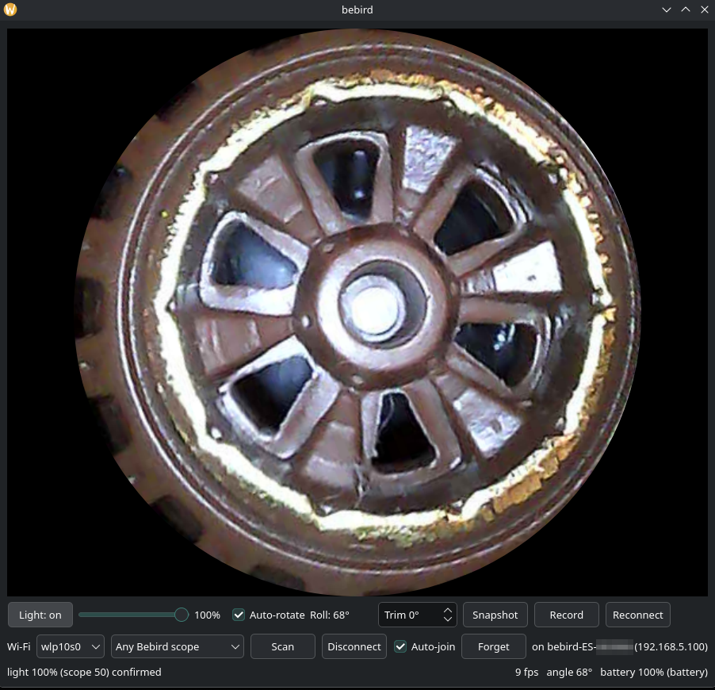

# Desktop app (Linux)

A small PyQt6 viewer, [`viewer.py`](../viewer.py), plus command-line tools.

- Live video (MJPEG, ~10 fps at 480×480)
- Tip-light dimmer mapped onto the LED's visible range, applied after a short debounce and read back to confirm
- Auto-rotate from the scope's built-in motion sensor, with a manual trim
- Snapshots (as displayed, with date, roll, light and battery in the EXIF metadata) and recordings (raw stream, `.mkv`)
- Battery level and charging state
- Wi-Fi handling: finds the scope's network, joins it without taking over your normal networking, and rejoins and restarts video when the scope comes back after a power cycle

| | |
|---|---|
|  |  |
| The viewer, pointed at a Hot Wheels Unimog for scale. | One wheel of the same truck at the lens's focus distance, which shows the field of view and sharpness you get in use. |

## Requirements

- Linux (the tools use a Linux ioctl to find the Wi-Fi interface address)
- Python 3.10+ with **PyQt6** and **Pillow** (`pip install PyQt6 Pillow` or your distro's packages)
- **ffmpeg** for recording (optional); `ffplay` for `grab.py --live` (optional)
- **NetworkManager** (`nmcli`) for the built-in Wi-Fi controls. Without it, join the scope's network yourself.
- A Wi-Fi interface you can dedicate to the scope while viewing. If your only internet connection is Wi-Fi on the same card, you'll be offline while connected to the scope.

The [standalone app](#standalone-app) bundles Python, Qt and Pillow.

## Setup

The scope is an **open access point** named `bebird-ES-XXXXXX` that gives out addresses in `192.168.5.0/24`; the camera is `192.168.5.1`.

The viewer handles joining it. Any network whose name starts with `bebird` counts as a scope. The Wi-Fi row defaults to **Any Bebird scope**, which prefers the scope you used last (remembered in `~/.config/bebird/last-device.json`; **Forget** clears it) and otherwise takes the strongest one in range. You can also pick a specific network. Press **Connect**. The first time, it creates a NetworkManager connection for that network that
- never becomes the default route,
- has IPv6 turned off,
- doesn't autoconnect on its own,

so a wired link or another network keeps carrying your normal traffic. With **Auto-join** on (the default), the viewer rejoins the scope's network whenever it reappears, for example after the scope switches itself off and you power it back on, and restarts the video.

The Wi-Fi interface is picked automatically: the one you last used, else the first Wi-Fi device NetworkManager knows. To force one, set `BEBIRD_IFACE`, which also applies to the command-line tools:

```sh
export BEBIRD_IFACE=wlp10s0
```

To join by hand instead, for example without NetworkManager's GUI rights, use the equivalent command:

```sh
nmcli con add type wifi ifname wlan0 con-name bebird-ES-XXXXXX ssid bebird-ES-XXXXXX \
    ipv4.never-default yes ipv6.method disabled connection.autoconnect no
nmcli con up bebird-ES-XXXXXX
```

If you run a host firewall that drops inbound UDP (for example ufw's default), allow the scope's subnet on that interface:

```sh
sudo ufw allow in on wlan0 from 192.168.5.0/24   # your Wi-Fi interface
```

Every socket binds to the Wi-Fi interface's address, so nothing meant for the scope can leak onto another network that happens to also use `192.168.5.1`.

## Standalone app

`make app` builds `dist/bebird-viewer`, a single self-contained executable (about 55 MB: Python, Qt and Pillow included). The machine running it needs no Python install. It's built on Ubuntu 22.04, the oldest base the current PyQt6 wheels install on, so it runs on distributions with **glibc 2.35 or newer** (Ubuntu 22.04, Debian 12, Fedora 36 and later). The build container has no network access and sees only the source files, read-only; only `dist/` is writable. The build needs Docker; see [building.md](building.md).

```sh
make app                                         # builds the image on first use, then the binary
make app && make install                         # binary to ~/.local/bin, plus a launcher entry and icon
make app && sudo make install PREFIX=/usr/local  # system-wide
make uninstall
make run                                         # or run from source (no build involved)
```

`make run` is the one target that installs anything on your machine: `make venv` creates `.venv` with PyQt6 and Pillow from pip, for running from source only.

`make install` only copies an existing build, so the build never runs as root. The binary bundles Python, Qt and the X11 libraries Qt needs, but uses the host's OpenGL (`libGL`/`libEGL`) and Wayland client libraries, which any desktop system has. It still calls host programs: install **ffmpeg** for recording and **NetworkManager** (`nmcli`) for the Wi-Fi controls.

The single-file binary unpacks itself to a temporary directory on each launch, so it takes a few seconds to start.

## Usage

```sh
./live.sh                          # the viewer
./grab.py 10 --out frames          # save 10 s of JPEG frames
./grab.py --live | ffplay -f mjpeg -i -
./light.sh 30                      # raw light level 0-100 (0 = off); no argument reads it
./send.py 66 39 01 01              # raw command, prints the reply (here: board-info JSON)
```

### Viewer controls

| Control | Key | Does |
|---|---|---|
| Light button | `L` | tip light off / back to the previous level |
| Light slider | `↑` `↓` ±1, `PgUp` `PgDn` ±10 | brightness; sent 300 ms after you stop adjusting, then read back |
| Auto-rotate | `A` | keep the picture upright using the motion sensor |
| Roll | — | live roll angle from the sensor |
| Trim | `[` `]` | manual rotation added on top, 15° steps |
| Snapshot | `S` | saves the displayed image to `~/Pictures/bebird/`, with metadata (below) |
| Record | `R` | records the raw stream to `~/Pictures/bebird/*.mkv` |
| Reconnect | — | restart the video session |
| Wi-Fi row | — | interface, scope network (default: any), Scan, Connect/Disconnect, Auto-join, Forget |
| | `F` / `Esc` / `Q` | fullscreen / leave fullscreen / quit |

Light level, trim, auto-rotate, the Wi-Fi interface and network, and Auto-join are remembered in `~/.config/bebird/state.json`. On connect, the viewer waits for video, then re-applies the saved light level so the scope's state matches the UI.

`BEBIRD_DEBUG=1 ./live.sh` prints per-second packet and frame counts, and the JPEG decoder's warnings. About 1 frame in 100 from the scope's encoder has a stray byte before its end marker; it decodes fine, so that warning is hidden otherwise.

### Snapshot metadata

Each snapshot records how it was taken, which makes a series of images self-describing:

- **Standard EXIF:** date and time taken with timezone offset, Make/Model (`Bebird` / `ES`), Software (`bebird-viewer`), and Orientation "normal", since the rotation is already applied to the pixels.
- **ImageDescription:** a readable line, e.g. `roll 47 deg, rotated 47 deg (auto) + trim 0 deg, light 100% (scope 50), battery 100% (battery)`.
- **UserComment:** the same data as JSON, plus the scope's model, hardware and firmware.

The scope's serial number and unique ID are deliberately left out, because these pictures tend to get shared. The scope seems to answer the board-info request only soon after power-on, so the viewer caches the last answer in `~/.config/bebird/state.json`.

```sh
exiftool -ImageDescription -UserComment ~/Pictures/bebird/*.jpg
```
